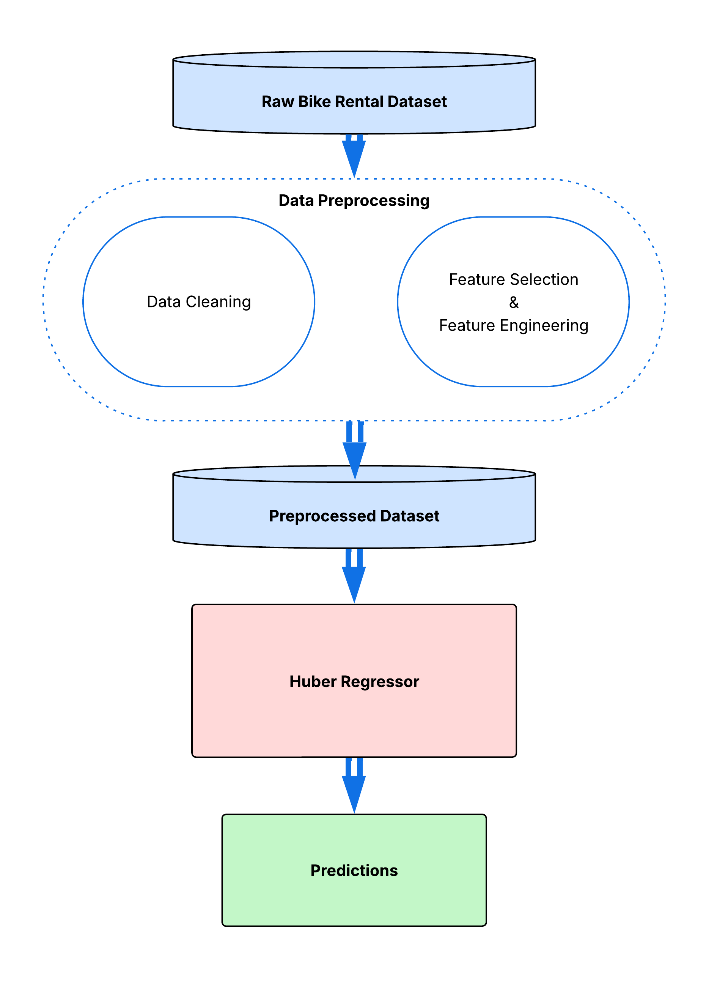

# Optimizing Maintenance Scheduling via Daily Bike Demand Prediction Using Stacking Regression
**Authors**: Byron Washington, Kenzy Elrefaay, Brad Leonard, William McCarty, Venus Onyango, Geonwoo Roh
## Introduction

As cities increasingly rely on sustainable transportation alternatives, bike-sharing has become a vital part of city infrastructure. This study focuses on building a predictive model to forecast daily bike rental demand for a bike-share company, helping optimize resource allocation and maintenance scheduling for businesses. This project began by defining the primary business question and preparing the dataset through cleaning and feature engineering. This study uses the Seoul Bike Sharing Demand Dataset, which was donated to UC Irvine in 2020. The data was collected during the years 2017-2018 and was unaffected by the COVID-19 pandemic of 2020.

The data was originally recorded by hour but transformed into daily values for this study and modified by adding new feature interactions. Additionally, tools such as the Yeo Johnson transformer and the StandardScaler were used to normalize the data. Over 30 algorithms were tested in the modeling phase, and model performance was evaluated using R2, Root Mean Squared Error, and cross-validation scores, with the use of a stacking regressor to enhance results. Deployment focused on applying the final model to support operational decisions, such as optimizing maintenance scheduling.

The following workflow diagram describes our modeling process from start to finish:

*Figure 1: Workflow Diagram of Project Process*

The final model revealed that certain weather-related factors, such as temperature 
and precipitation, were key predictors of rental demand. By leveraging these insights, bike-share companies can schedule maintenance during lower-demand periods and maximize availability during peak times. Ultimately, the study addresses the business question by providing a model that the bike rental company can use to predict daily demand and to better meet customer needs.

## Business Question & Background
In cities with the infrastructure to support it, bike rental systems have become an option for people looking for a simple method of transportation. By the end of 2017, estimated total bike-sharing system revenues have come out to around $10 billion, and the industry continues to grow (Westland et al., 2019). The rollout of bike rental and bike-sharing systems can help with the reduction of traffic congestion, air pollution, and noise pollution. They are affordable for the average consumer, working particularly well for short trips. Frequent riders also gain the health benefits of regular physical activity (Kim, 2019). To improve customer access, bike-sharing companies need to regularly maintain their bikes to ensure they are safe and usable. This maintenance is scheduled when bike usage is at a low point in a given set of days. Without reliable forecasting of bike rentals, businesses risk customer dissatisfaction, revenue loss, and resource mismanagement due to unpredictable demand fluctuations caused by factors like weather, events, and promotional offers (Kim, 2018).

Unlike public transportation models that rely on consistent weekday patterns, this project focuses on irregular, seasonal, and weather-sensitive usage behaviors. The goal is to provide rental operators with insights for planning repairs, staff scheduling, and demand surges during weekends or special events.

Bike demand forecasting has been widely explored, especially for urban commuter systems that generate large volumes of data and have well-established infrastructure. These systems support complex modeling approaches. 

| Article Name | Method Used | Limitations |
| -------- | ------- | ------- |
| Modeling of the daily dynamics in bike rental system using weather and calendar conditions: A semi-parametric approach Odoom et al. (2024) | Penalized splines quasi-Poisson regression <ul><li>Response to Poisson over-dispersion</li><li>Captures linear and non-linear relationships with bike rental count</li></ul> | <ul><li>Shorter time frame</li><li>Exclusive to one city</li><li>Low interpretability</li></ul> |
| Investigation on the effects of weather and calendar events on bike-sharing according to the trip patterns of bike rentals of stations Kim (2018) | Negative Binomial Regression <ul><li>Response to poisson over-dispersion</li><li>Used clustering to determine individual stations' peak hours</li><li>Effective for cities</li></ul> | <ul><li>Didn't consider as many factors</li><li>Exclusive to one city</li><li>Less beneficial at smaller scales</li></ul> |
| Forecasting Bike Rental Demand Using New York Citi Bike Data Wang (2016) | Enhanced Random Forest | <ul><li>Shorter time frame</li><li>No location data</li><li>Focus on technical aspects rather than practical uses</li></ul> |
| Demand cycles and market segmentation in bicycle sharing Westland et al. (2018) | Wavelet Decomposition/Convolutional Neural Network | High computing power required |
| Predicting bike sharing demand using recurrent neural networks Pan et al. (2019) | Long Short-Term Memory Neural Network <ul><li>Handles long-term patterns effectively</li></ul> | <ul><li>Exclusive to one city</li><li>Lacks interpretability</li><li>Needs large volume of data</li></ul> |

*Table 1: A table summarizing previous studies about bike sharing research.*

This project builds upon prior research by evaluating the effectiveness of numerous types of regression models to analyze daily data. The studies shown in Table 1 focus on features that are easy to access such as temperature, humidity, and precipitation data. This gives operators an easily interpretable way to make timely and informed decisions regarding their businesses.  

In addition, most studies on bike demand forecasting focus on commuter-based systems in large cities, where data is collected from multiple stations with steady, predictable usage. These models often depend on detailed spatial data to track rentals across locations to find patterns. In contrast, our dataset does not include individual station data, which makes those location-based models challenging to apply in this case. This highlights a gap in current research on predicting demand when rentals are tracked more generally, rather than by individual location. Because this dataset lacks location-specific information, this study bridges that gap by ensuring the results can be applied across various cities. 

The business question that this study plans to answer is: How can a bike rental company accurately predict daily rental demand to plan maintenance while ensuring that bikes are available when customers need them most?

## Analytic Question
This study addresses the need for an accurate and interpretable model to predict daily bike rental demand for a bike-share system operating at a city-wide level. The goal is to provide rental operators with forecasts that allow optimal maintenance scheduling and inventory management while maintaining sufficient bike availability for customers. 

The following fishbone diagram in Figure 2 represents the assumptions made about the data. These are the factors that go into determining whether people will be encouraged to use bikes as an alternative mode of transportation:

*Figure 2: Fishbone diagram showing assumptions made about major variables predicting bike count.*
In addition to these assumptions, another main assumption was that customers were checking the weather before deciding to rent a bike.
The research problem, effectively predicting daily rental demand to schedule maintenance, was decomposed into a target (daily rented bike count) and features that could reasonably be forecasted in advance:
* Environmental factors: temperature, wind speed, humidity, visibility, solar radiation, rainfall, snowfall, and precipitation.
* Temporal and seasonal factors: working day, holiday, and seasons (spring, summer, winter, fall).
* Interaction terms (further mentioned in the data cleaning section): season-temperature combinations (e.g., Spring*Temp)

Regression was chosen as the modeling approach because the objective is to predict a known, continuous target variable: the daily rented bike count. Since the target is not a category or class, but a numeric value, regression is the optimal choice. The regression model is represented by this black box diagram:

*Figure 3: Blackbox diagram showing chosen features for the regression model.*

## Methods and Tools
The 'Kitchen Sink' modeling approach was used to test a wide range of regression models across different algorithmic families. It ensures that potentially high-performing models are not ruled out due to assumptions or bias. in total, over 30 algorithms were evaluated, including: 
* Linear models: Ridge, Lasso, Elastic net, Huber, Lars
* Support vector models: SVR, NuSVr, LinearSVR
* Tree-based models: Decision Tree, Random Forest, Extra Trees, Graident Boosting, Hist Gradient Boosting
* Neural networks: MLP Regressor
* Other sepcialized models: RANSAC, Guassian Process, Bayesian Ridge, Tweedie Regressor, Orthogonal Matching Pursuit, etc.

The evaluation metrics for these models are as follows:

| Metrics Selected | Shorthand | Range of Values | What they represent |
| - | - | - | - |
| R2 | r2_test, r2_train | Test R2 >= 0.70 | How much of the variance of our output is explained by independent variables |
| R2 difference | r2_diff | R2 Diff >= -0.15 | Difference between test variance and train variance |
| Root Mean Squared Error | rmse | RMSE < 6000 | Average difference between predicted and actual value |
| Mean Squared Error | mse_train, mse_test | Any | Mean squared error of our predicted value |
| Mean Squared Error Difference | mse_diff | Any | Difference between test MSE and train MSE |
| Cross Validated R2 Score | cv_r2_score | Any | Mean score of cross validation folds |

*Table 2: Table of metrics and values showing the model rejection process' evaluation metrics.*

The test accuracy threshold (r2_test) was set based on the top 20% of r2_test scores for the regression models tested. Thresholds for r2_diff and RMSE were then derived from the model at the 20th percentile of this top-performing group, with r2_diff required to be greater than and RMSE less than the corresponding values from that model.

After comparing model performance, finalists were chosen using GridSearch for hyperparameter tuning. They were chosen with a strict balance of accuracy vs. over-fitting. The finalists were: 
The finalists were:
* ElasticNet
* HuberRegressor
* ExtraTressRegressor

The final model selected was a stacking regressor model, with the estimators (base models) being HuberRegressor, which is robust to outliers, and ElasticNet, which handles multicollinearity; and the final estimator (meta model) being Ridge.

## Data Preparation & Exploration

The source of the data is the Seoul Bike Sharing Demand Dataset (2020). This data was collected between December 2017 to November 2018 and recorded for each hour in Seoul, South Korea. The data file type is .xlsx and it is structured in tabular format with 8760 rows and 14 columns.

For a clearer understanding of the dataset's structure and the variables involved, the following data dictionary outlines the key attributes recorded in the dataset:

| Feature Name | Description | Categorical/Numerical | Units | Missing Values | Unique Values | Example Values |
| - | - | - | - | - | - | - |
| Day | Date when data was recorded | Categorical | (DD/MM/YYYY) | 0 | 365 | 22/03/2018 |
| Rented Bike Count | Number of bikes rented on given date and hour | Numerical | Bikes | 0 | 2166 | 930 |
| Hour | Hour of the day during which data was recorded | Numerical | Hour | 0 | 24 | 8 |
| Temperature | Temperature recorded at given hour | Numerical | °C | 0 | 546 | 7.6 |
| Humidity | Relative humidity during given hour | Numerical | % | 0 | 90 | 37 |
| Wind Speed | Wind speed in given hour | Numerical | m/s | 0 | 65 | 1.1 |
| Visibility | Visibility level per 10m | Numerical | 10m | 0 | 1789 | 2000 |
| Dew Point Temperature | Dew point temperature in given hour | Numerical | °C | 0 | 556 | -19.8 |
| Solar Radiation | Total solar radiation per hour | Numerical | MJ/m² | 0 | 345 | 0.01 |
| Rainfall | Amount of rainfall | Numerical | Mm | 0 | 61 | 0 |
| Snowfall | Amount of snowfall | Numerical | Cm | 0 | 51 | 0 |
| Seasons | Season during which data was recorded | Categorical | Spring, Summer, Fall, Winter | 0 | 4 | Winter |
| Holiday | Indicates whether there was a holiday | Categorical | Binary (0 = No, 1 = Yes) | 0 | 2 | No Holiday |
| Functioning Day | Whether bike-rental service was operational that day | Categorical | Binary (0 = No, 1 = Yes) | 0 | 2 | Yes |

*Table 3: Data Dictionary for the Seoul Bike Sharing Demand Dataset.*

To better answer the business question, all 24 hours for each day were aggregated and transformed as shown in the table below:
| Averaged Values | Totaled Values | Maximized Value | First Values |
| - | - | - | - |
| Temperature | Rented Bike Count | Solar Radiation | Seasons |
| Dew Point Temperature | Rainfall | | Functioning Day |
| Humidity | Snowfall | | Holiday |
| Wind Speed |			
| Visibility |			

*Table 4: A table showing the modifications made to each feature after converting to daily data.*

Some features were averaged because they didn’t vary throughout the day in comparison to the other features. Precipitation-related features were totaled to represent the accumulated amount in a given day. The Rented Bike Count was also totaled to capture the cumulative number of bikes rented on a given day. We took the maximum value of Solar Radiation because many hours had no sunlight (evening and early morning), and taking the average would skew the distribution. The First Values column represents the value for the first hour of the categorical features in the dataset that did not change throughout the day.

## Data Cleaning & Preprocessing

After data exploration, features that would make building a predictive model difficult were dropped. Holiday was dropped due to high class imbalance and a poor correlation value of -0.11 with the target variable Rented Bike Count, meaning it did not have much of an effect on the target variable. Dew Point Temperature was dropped as it was too correlated to Temperature with a value of 0.96 and showed mostly identical data.

In the Functioning Day column, the rows where the value was set to False, were dropped. On those days, no bikes were rented, regardless of the weather. Since only 12 days (less than 2% of the data) were labeled False, keeping these rows would cause the model to incorrectly correlate good weather with no rentals. After dropping those rows, the feature, Functioning Day, was dropped as it did not provide any insight with all the rows being the same value.

The Seasons feature is categorical, meaning some models might have trouble handling it. To ensure the use of as many models as possible, Seasons was one-hot encoded into Spring, Summer, and Winter.  When one-hot encoding Seasons, the Pandas function ‘get_dummies()’ was used which has a parameter called ‘drop_first’. Setting this equal to True, allows n-1 features for each category in Seasons which is important to reduce the noise within the dataset. The dropped feature, Autumn acts as a baseline, so when the explicitly stated seasons are all false, it is the equivalent of Autumn within the model.

In the final portion of preprocessing, a partial dependence algorithm from scikit-learn was used to analyze interactions between features. The goal was to identify unique feature combinations that help predict bike count. Each interaction's strength was measured by how much the model's prediction changed when two features varied together, using the standard deviation of those changes as the metric. The interactions between Temperature and Seasonality showed a strong effect overall, so they were included to fully capture how temperature varies with seasonality. Additionally, the combination of Rainfall and Snowfall was included to represent the total moisture effect on bike count. This caused an increase in the model’s accuracy and a reduction in overfitting.

To analyze the effect of the new feature set on the target variable, a correlation matrix was produced:

*Figure 4: A correlation matrix showing the correlation of all variables to each other.*

Additionally, basic statistical analyses (mean, standard deviation, IQR, etc.) were performed on each column to better understand the distribution of values and their potential relationship to the target variable.

| | Rented Bike Count |	Temperature (C) |	Humidity (%) |	Wind Speed (m/s) | Visibility (10m) | Solar Radiation (MJ/m²) | Precipitation (cm) | Rainfall (mm) |
| - | - | - | - | - | - | - | - | - | 
| count | 353 | 353 | 353 | 353 | 353 | 353 | 353 | 353 |
| mean | 17485.31 | 12.78 | 58.17 | 1.72 | 1434.01 | 2.07 | 2.22 | 3.58 |
| std | 9937.16 | 11.72 | 14.87 | 0.59 | 491.16 | 0.91 | 8.86 | 11.79 |
| min	| 977	| -14.73	| 22.25 | 0.66 | 214.29	| 0.15 | 0 | 0 |
| 25% | 6967 | 3.30 | 47.58 | 1.30 | 1087.04 | 1.2 | 0 | 0 |
| 50% | 18563 | 13.74 | 57.17 | 1.66 | 1557.75 | 2.23 | 0 | 0 |
| 75%	| 26285 | 22.59 | 67.71 | 1.95 | 1874.29 | 2.87 | 0.2 | 0.5 |
| max | 36149 | 33.74 | 95.88	| 4 | 2000 | 3.52 | 79.79 | 95.5 |

*Table 5: Basic statistical analysis of each of the variables used in the model.* 

| | Snowfall (cm) | Spring	| Summer	| Winter	| SpringTemp | SummerTemp | WinterTemp |
| - | - | - | - | - | - | - | - |
| count | 353 | 353 | 353 | 353 | 353 | 353 | 353 | 353 |
| mean | 1.86 | 0.25 | 0.26 | 0.25 | 3.32 | 6.93 | -0.65 |
| std	| 8.80 | 0.44 | 0.44 | 0.44 | 6.36 | 11.83 | 2.65 |
| min | 0 | 0 | 0 | 0 |	-1.15	| 0 | -14.74 |
| 25% | 0 | 0 | 0 | 0 | 0 | 0 | 0 |
| 50% | 0 | 0 | 0 | 0 | 0 | 0 | 0 |
| 75%	| 0 | 1 | 1 | 1 | 0.45 | 21.3 | 0 |
| max | 78.7 | 1 | 1 | 1 | 22.69 | 33.74 | 6.13 |

*Table 6: Continuation of basic statistical analysis of each of the variables used in the model.*

To build a proper linear regression model, the dataset required normalization. As a solution, the Yeo-Johnson transformer was used on the most skewed features: Rainfall, Snowfall, and Precipitation. This transformation is similar to the log-like Box-Cox transformation, where data is right-skewed and it brings the values closer to 0 while keeping their relative distance. The difference is that this transformation allows for non-positive values as input. This transforms non-normal dependent values into a more normal (Gaussian) shape (Yeo et al., 2000).

*Equation 1: Yeo-Johnson transformer equation.*

The scaler used —StandardScaler, a z-score-based scaler from scikit-learn— standardizes features that originally existed in different units. However, StandardScaler assumes that the input data follows a roughly normal distribution. Transforming the data first, ensures that this assumption is met, ensuring that each feature has an equally proportional contribution to the model training.

## Model Building & Testing

After exploring and transforming the data, the regression model must adapt to at least two specific characteristics of the dataset. The feature interactions that were created will naturally be correlated with the features they are comprised of, which is an indicator that multicollinearity exists. Additionally, some of the features, even after transformation, had irregular distributions which then led to outliers. Therefore, models that handle multicollinearity and non-normal distributions were expected to perform well, such as Huber Regressor, and Decision Trees.

Initially, grid searching was used to run through all regressors within the scikit-learn database. The main metrics used to filter through models were the accuracy (R2), Mean Squared Error (MSE), Root Mean Squared Error (RMSE), and the cross-validated R2 test score across 5 shuffled folds. 

To determine signs of overfitting, the difference in R2 between the test and train was used. If there were no signs of overfitting, the main metrics used in filtering down which models performed the best would be MSE and RMSE. Ultimately, the focus ended up on RMSE because it is in the unit of the target variable, and thus more interpretable. The initial results showed that regularized models performed the best, while all models that utilized Decision Trees, including ensemble methods, consistently overfit.

After careful consideration, the models were narrowed down to the models with the highest test accuracy, least overfitting, and top cross-validated score. These models were the Huber, ElasticNet, and ExtraTrees regressors.

Huber is a model that uses L2 regularization. It is robust to outliers by using a unique loss function that penalizes larger errors (i.e. outliers) more than smaller errors. ElasticNet performs a mixture of both L1 and L2 regularization, which means it can handle many features in a model, as well as multicollinearity. These models are linear regression models, which means they can only capture feature interactions that are explicitly given to them. This makes it difficult to know if all interactions between the weather features have been truly captured. 

Similar to RandomForest (RF), ExtraTrees is an ensemble method of decision trees, but instead of finding the best values to split to minimize loss, it splits at random thresholds. This makes it better at reducing variance and overfitting than RF as it can capture interactions that the linear models can’t. The shortcoming of this model is that even though it can capture those interactions, it tends to overfit.

### Tuning

For hyperparameter tuning, two main methods were utilized. Firstly, scikit-optimize's BayesSearchCV was used to perform Bayesian Optimization for tuning over a large search space. This method takes the minimum and maximum of the numerical and randomly selected categorical hyperparameters to make sequentially better guesses at hyperparameter values that would maximize test accuracy. After finding the top 50 combinations with the highest test accuracy, the difference between test accuracy and its corresponding training accuracy was then used to check for overfitting, then they were finally sorted by RMSE and converted into a Pandas dataframe. After tuning with the Bayesian Optimization function, the second function was made using GridSearchCV which was like the first function, but instead of finding the minimum and maximum of each numerical and random categorical hyperparameters, it would test all possible combinations of hyperparameters. 

The tested hyperparameter search spaces were chosen based on each model's characteristics and are summarized below, along with explanations of their impact on model behavior.
| Model | Hyperparameter | Values | Purpose |
| - | - | - | - |
| Huber | epsilon | [1.0, 1.35, 2.0, 5.0]	| Threshold for treating residuals as outliers |
| | alpha | [1e-5, 1e-3, 0.1, 1] | Regularization strength |
| | max_iter | [100, 250, 500, 1000] | Maximum number of iterations to converge |
| ElasticNet | alpha	| [0.0001, 0.001, 0.01, 0.1, 1.0, 10.0] | Overall regularization strength |
| | l1_ratio | [0.0, 0.1, 0.25, 0.5, 0.75, 0.9, 1.0] | Balance between L1 (sparsity) and L2 (stability) penalties |
| ExtraTrees |	max_depth |	[6, 15, 30] | Maximum depth of individual trees |
| | min_samples_split |	[2, 9, 12, 50, 100] | Minimum samples needed to split an internal node |
| | min_samples_leaf	| [1, 10, 13, 50, 100] | Minimum samples needed to be at a leaf node |
| | n_estimators | [5, 50, 100, 500] | Number of trees in the forest |

*Table 7: A table of the hyperparameters tested while tuning.*

### Initial Results
| Model | R2 Test (%) | R2 Train (%) | MSE Test | MSE Train | RMSE |
| - | - | - | - | - | - |
| Huber | 84.88 | 85.09 | 14,111,967.99 | 14,828,877.82 | 3809.46 |
| ElasticNet | 82.23 | 82.65 | 17,056,413.45 | 17,256,143.91 |4129.94 |
| ExtraTrees | 89.92 | 95.73 | 9,676,471.74 | 4,244,036.68 | 3110.70 | 

*Table 8: A table of metrics for our 3 models after hyperparameter optimization.*

While it’s tempting to view ExtraTrees in Table 6 as the most effective model due to its high R2 and low RMSE, the accuracy difference shows a clear sign of overfitting. As a result, the linear regression models are considered better candidates. Table 6 shows that Huber has the most useful results so far. Moving forward, performance could potentially be enhanced through the implementation of a stacking regression model.

The benefit of a stacking regressor is its ability to leverage the strengths of multiple models and fuse them into a meta-model to produce more accurate predictions. In this approach, the predictions generated by the base models are used as inputs for a final estimator. With the characteristics of the dataset, the following section will show the setup that was chosen for the stacking regressor.

### Final Result  
For the final model, a 5-fold shuffled cross-validation strategy was employed to ensure that the meta-model was trained on a variety of samples, reducing the risk of overfitting. The base estimators were Huber and ElasticNet, and their predictions served as input to the final estimator, Ridge. Huber was selected to ensure robustness against outliers, while ElasticNet handled multicollinearity and provided feature stability. Ridge was chosen as the meta-model due to its ability to manage collinear inputs from the base models and produce a smooth, generalized final output.

*Figure 5: Visualization of stacking regressor.*

The hyperparameters and metrics for models in the final model are as follows:

| Model | Hyperparameters | Final Selected Values |
| - | - | - |
| Huber | epsilon, alpha, max_iter | 1.35, 0.001, 1000 |
| ElasticNet | alpha, l1_ratio | 0.1, 0.5 |
| Ridge (meta-model) | alpha | 1.0 |

*Table 9: Table of hyperparameters in the finalized model.*

| Metric | Test | Train | Difference |
| - | - | - | - |
| Accuracy (R²) | 85.25% | 85.46% | -0.21% |
| Mean Squared Error (MSE)	| 14,160,869.86 | 14,458,515.98 | -297,646.12 |
| Root Mean Squared Error (RMSE)	| 3,763.09 | 3,802.44 | -39.35 |

*Table 10: Table of metrics in the finalized model.*

*Figure 6 & 7:  Predicted vs Actual plot for final model & Residual Plot for final model*
### Equation
Below are the two final regression equations, one in the context of the stacked regressor, and the other in the context of the original features:
#### Stacking Regression Equation:
$BikeCount = –59.8381 + 1.3588 * Huber(x) – 0.3538 * ElasticNet(x)$
#### Final Regression Equation:
$BikeCount = 21442.5055 + 6096.0886 * Temperature + 403.3250* Humidity – 530.4617 * WindSpeed + 609.6913 * Visibility + 2656.5225 * SolarRadiation 	– 79.1618 * Precipitation + 2226.4483 * Rainfall – 3302.0868 * Snowfall – 7290.8431 * Spring + 8716.0167 * Summer + 7031.5891 * Winter + 294.6582 * Spring * Temp – 560.1276 * Summer * Temp – 278.8207 * Winter * Temp$

The final model achieved a test accuracy of 85%, indicating that the relationships between weather conditions and bike rental behavior are predominantly linear or involve simple feature interactions, an outcome that aligns well with the design of the linear base models. The resulting regression equation highlights that bike rentals tend to increase most strongly with higher temperature and solar radiation, whereas snowfall, humidity, and wind speed have negative effects. Furthermore, interaction features like Spring*Temperature reveal that temperature’s effects vary by season, further improving the model’s flexibility. Overall, the model successfully fulfills the project goals by providing a generalizable and interpretable way to forecast bike rentals under varying weather conditions, while effectively managing outliers and multicollinearity. 

Although the final model achieved a high R² of 85.25% on the test set and an RMSE of 3,763.09, some limitations remain. Both Huber and ElasticNet are linear models, meaning they rely on explicitly given feature interactions and may fail to capture more complex nonlinear relationships, which is evident in Figure 7 based on the inconsistent variance in residuals. While nonlinear models like ExtraTrees initially performed better on RMSE (3110.70) and R² (89.92%), they exhibited clear overfitting (train R² of 95.73% vs. test R² of 89.92%), so they were excluded to prioritize generalization. Future improvements could involve incorporating nonlinear transformations, exploring weekend vs weekday, or adding more diverse base models to better capture complex feature interactions.

To ensure replicability, the random state was set to 1 across all randomized functions, including BayesSearchCV and GridSearchCV, data splitting (train_test_split), cross-validation (K-fold), and model randomizations (where applicable). All models were implemented in Python 3.12.10 using the scikit-learn library.

## Evaluation & Discussion 

This study successfully answered the business question by building a predictive model that allows bike rental companies to forecast daily rental demand based on weather and seasonal factors. The final stacking regressor model, which combined Huber and ElasticNet as base estimators and Ridge Regression as the meta-model, achieved a strong R² and a high RMSE. These results indicate strong predictive performance with minimal overfitting, making the model reliable for real-world operational use.

Even though this model is effective within its context, several limitations remain that could be explored by other studies in the future. While our dataset does not contain location data, it was still collected in Seoul, meaning there could be potential bias. It is possible that there are feature interactions that are not considered in the model (such as patterns of weather) which might improve our metrics. Although transformations were made to normalize the data, Rainfall and Snowfall are still right-skewed which could be throwing off the model. Lastly, limited tuning was performed on stacking regressor combinations so trying different combinations of base models might improve our results.

Because the model only requires inputs such as weather forecasts and seasonality, features available in advance, it can be directly integrated into daily and weekly planning. Rental companies can use this model to optimize several key business operations:
 - **Maintenance Scheduling:** 
When the model predicts low daily demand (e.g., below ~10,000 rentals), 
companies can prioritize major maintenance activities without risking a shortage of 
bikes for customers. This ensures minimal revenue loss and maintains service 
quality. 
 - **Staff Planning:** 
For days when predicted demand exceeds 25,000 rentals, companies should plan 
to increase staffing levels at rental hubs to manage higher customer flow, reducing 
wait times and improving customer satisfaction. 
 - **Inventory and Bike Redistribution:** 
The model enables companies to anticipate demand spikes (e.g., ~27,000+ rentals 
on sunny days) and proactively redistribute bikes to high-traffic areas, ensuring 
availability and preventing lost sales. 
 - **Scalability Across Cities:** 
Since the model does not rely on location-specific data (e.g., individual station 
information), it is generalizable to other cities with similar seasons and weather 
patterns. This makes it a scalable solution for companies looking to expand their 
rental operations. 

In the future, researchers could also include variables that account for the pricing of bikes, bike accessibility, and the current condition of individual bikes, temporal factors, and other additional environmental factors (such as air quality or UV) as they would be the most likely to be predictors of bike count. This would further enhance predictive power and operational value. 

## References
See `references.bib`.