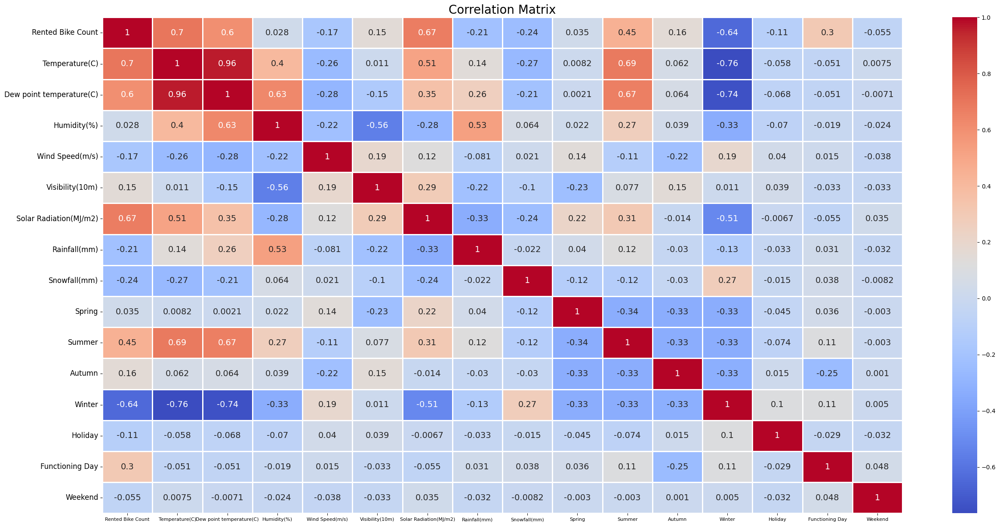
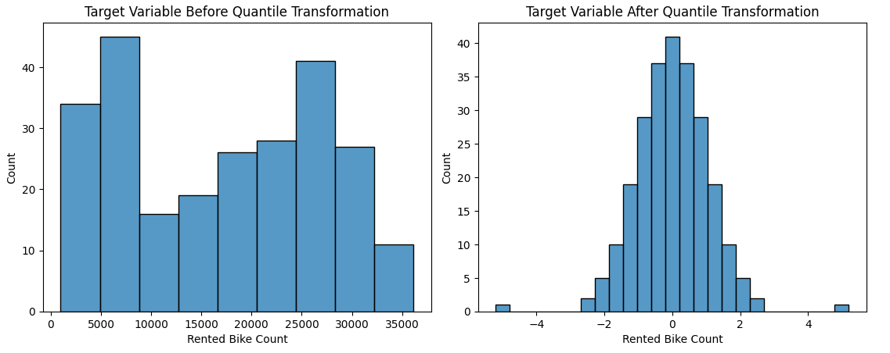
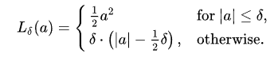
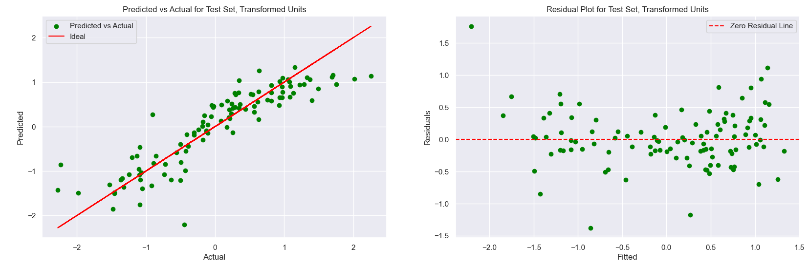
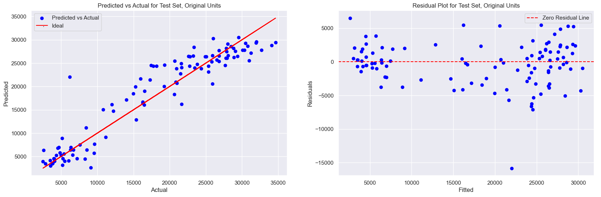
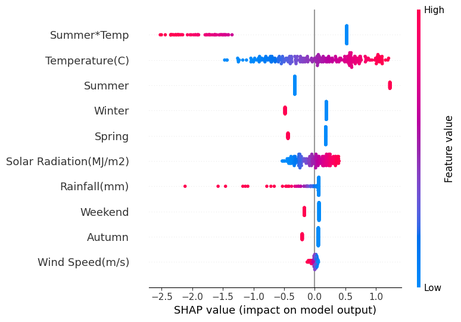

# Daily Bike Demand Prediction Using Robust Regression
**Author**: Byron Washington
## Abstract
As cities increasingly rely on sustainable transportation alternatives, bike-sharing has become vital to city infrastructure. With this surge in popularity, bike rental companies need a way to effectively predict their daily demand to optimize maintenance scheduling, staffing, and profits. This study aims to accurately predict daily rental demand to plan maintenance while ensuring that bikes are available when customers need them most. This study provides a robust regression method to predict the daily demand for bike rentals, given mainly weather data and some temporal data, while maintaining generalizability. The model was initially evaluated with its coefficient of determination (R²), then with its Root Mean Squared Error (RMSE) in fine-tuning.

The results show that *Temperature*, *Season*, *Wind Speed*, *Solar Radiation*, *Rainfall*, and whether it was a weekend are significant predictors of daily bike rental demand. While *Summer* was the strongest predictor, showing a positive effect on bike rentals, the interaction between *Temperature* and *Summer* shows that the hotter it gets in the summer, the fewer rentals there are. The result of our *Weekend* feature (1 if Saturday/Sunday, 0 otherwise) shows that customers usually prefer to rent bikes during the week. This result suggests that bicycles are primarily used for commuting rather than leisure in the city where the data was collected. This study aims to provide insights like those for bike rental companies to meet their customers' needs while maximizing profit effectively.

## Background
As the world's attention focuses more on climate change, some people are now looking for ways to reduce their carbon footprint, especially in terms of transportation. Biking has become one of the more popular ways to travel as it has no carbon footprint, is a good form of exercise, and is a cost-effective way of transportation [@Kim2018]. By the end of 2017, estimated total bike-sharing system revenues had reached around $10 billion, and the industry continues to grow [@Westland_Mou_Yin2019]. To improve customer access, bike-sharing companies must regularly maintain their bikes to ensure they are safe and usable. This maintenance is scheduled when bike usage is low in a given set of days. Without reliable forecasting of bike rentals, businesses risk customer dissatisfaction, revenue loss, and resource mismanagement due to unpredictable demand fluctuations caused by weather, events, and promotional offers [@Kim2018].

Bike demand forecasting has been widely explored in various studies, especially for urban commuter systems with large volumes of data and well-established infrastructure. The analysis of Daejeon's "Tashu" system revealed that temperature extremes, such as heatwaves, and non-working days significantly alter rental patterns at different rental stations, showing how rental behaviours differ in commuting versus leisure across locations [@Kim2018]. Similarly, a semi-parametric modeling approach for DC's "Capital Bikeshare" demonstrated that calendar variables like working days and seasons have distinct effects on both casual and registered users, suggesting that demand is not uniformly responsive and should be managed dynamically [@Odoom_Boateng_Mensah_Maposa2024]. Another study incorporates a deep learning approach using a two-layer long short-term memory (LSTM) recurrent neural network for New York City's "Citi Bike" system. The modeling approach boasts high predictive power but lacks general interpretability and insights for companies to use [@Pan_Zheng_Zhang_Yao2019]. Finally, evidence from the study involving Beijing's bike-sharing system shows the value of market segmentation, revealing that user habits and patterns are highly stratified and that demand prediction can improve significantly when customer groups are modeled separately [@Westland_Mou_Yin2019]. 

These studies focus on commuter-based systems in large cities, where data is collected from multiple stations with steady, predictable usage. These models often depend on detailed spatial data to track rentals across locations and find patterns. In contrast, our dataset does not include individual station data, which makes those location-based models challenging to apply in this case. This highlights a gap in current research on predicting demand when rentals are tracked more generally, rather than by individual location. Because this dataset lacks location-specific information, this study builds upon that prior research by ensuring the results can be applied across various cities. This will, in turn, provide rental operators with insights for planning repairs, staff scheduling, and demand surges during weekends or good weather conditions.

## Dataset
The source of the data is the [@dataset2020]. This data was collected between December 2017 and November 2018 and recorded for each hour in Seoul, South Korea. The data file type is .xlsx, and it is structured in tabular format with 8760 rows and 14 columns.

For a clearer understanding of the dataset's structure and the variables involved, the following data dictionary outlines the key attributes recorded in the dataset:

| Feature Name | Description | Categorical/Numerical | Units | Missing Values | Unique Values | Example Values |
| - | - | - | - | - | - | - |
| Day | Date when data was recorded | Categorical | (DD/MM/YYYY) | 0 | 365 | 22/03/2018 |
| Rented Bike Count | Number of bikes rented on a given date and hour | Numerical | Bikes | 0 | 2166 | 930 |
| Hour | Hour of the day during which data was recorded | Numerical | Hour | 0 | 24 | 8 |
| Temperature | Temperature recorded at given hour | Numerical | °C | 0 | 546 | 7.6 |
| Humidity | Relative humidity during given hour | Numerical | % | 0 | 90 | 37 |
| Wind Speed | Wind speed in given hour | Numerical | m/s | 0 | 65 | 1.1 |
| Visibility | Visibility level per 10m | Numerical | 10m | 0 | 1789 | 2000 |
| Dew Point Temperature | Dew point temperature in given hour | Numerical | °C | 0 | 556 | -19.8 |
| Solar Radiation | Total solar radiation per hour | Numerical | MJ/m² | 0 | 345 | 0.01 |
| Rainfall | Amount of rainfall | Numerical | Mm | 0 | 61 | 0 |
| Snowfall | Amount of snowfall | Numerical | Cm | 0 | 51 | 0 |
| Seasons | Season during which data was recorded | Categorical | Spring, Summer, Fall, Winter | 0 | 4 | Winter |
| Holiday | Indicates whether there was a holiday | Categorical | Binary (0 = No, 1 = Yes) | 0 | 2 | No Holiday |
| Functioning Day | Whether bike-rental service was operational that day | Categorical | Binary (0 = No, 1 = Yes) | 0 | 2 | Yes |

*Table 1: Data Dictionary for the Seoul Bike Sharing Demand Dataset.*

To predict daily demand rather than hourly, all 24 hours for each day were aggregated and transformed as shown in the table below:

| Averaged Values | Totaled Values | Maximized Value | First Values |
| - | - | - | - |
| Temperature | Rented Bike Count | Solar Radiation | Seasons |
| Dew Point Temperature | Rainfall | | Functioning Day |
| Humidity | Snowfall | | Holiday |
| Wind Speed |			
| Visibility |			

*Table 2: A table showing the modifications made to each feature after converting to daily data.*

Some features were averaged because they didn't vary throughout the day compared to the others. Precipitation-related features were totaled to represent the accumulated amount on a given day. *Rented Bike Count* was also totaled to capture the cumulative number of bikes rented on a given day. We took the maximum value of *Solar Radiation* because many hours had no sunlight (evening and early morning), and taking the average would skew the distribution. The 'First Values' column represents the value for the first hour of the categorical features in the dataset that did not change throughout the day.

### Data Cleaning
After data exploration, features that would make building a predictive model difficult were dropped. *Holiday* was dropped due to high class imbalance and a poor correlation value of -0.11 with the target variable *Rented Bike Count*, meaning it would not be a statistically significant predictor. *Dew Point Temperature* was dropped as it was too correlated to *Temperature* with a value of 0.96 and showed mostly identical data.

*Figure 1. Correlation Matrix of our original features*

In the *Functioning Day* column, the rows where the value was set to False were dropped. On those days, no bikes were rented, regardless of the weather. Since only 12 days (less than 4% of the data) were labeled False, there wouldn't be enough data for the model to learn this real-world rule. Thus, keeping these rows would cause the model to incorrectly correlate good weather with no rentals. After dropping those rows, the feature, *Functioning Day*, was dropped as it did not provide any insight, with all the rows being the same value.

The last issue with our data is that our target variable, *Rented Bike Count*, had a multimodal distribution. Since we want as many options for models as possible, this would violate the normality assumption for linear regression models. To fix this, scikit-learn's Quantile Transformer was applied to our target.

*Figure 2. Before and After Quantile Transformation of Target Variable*

### Feature Transformations/Engineering
*Snowfall* was listed in centimeters but *Rainfall* was in millimeters, so to prevent scaling issues, *Snowfall* was converted into millimeters. After converting, the feature had to be renamed, so while doing that, some other features were renamed to ensure consistent formatting. After renaming, *Seasons* was one-hot encoded to keep our options open for as many linear regression models as possible. After one-hot encoding, all booleans/binary categorical features were converted into numerical values, which is also required for linear regression models.

To capture how rentals vary throughout the week, a binary feature *Weekend* was created to capture whether the day is a weekend. *Summer\*Temp* and *Winter\*Temp* were also created to capture interactions between temperature and the seasons with extreme temperature, e.g., Summer and Winter.

## Modeling
For model selection, we used the 'Kitchen Sink' approach, which used grid searching for all regressors within the scikit-learn database. The primary metrics used to filter through models were the accuracy (R²), Mean Squared Error (MSE), Root Mean Squared Error (RMSE), and the cross-validated R² test score across five shuffled folds. The difference in R² between the test and train was used to determine signs of overfitting. If there were no signs of overfitting, the primary metrics used in filtering down which models performed the best would be MSE and RMSE. Ultimately, the focus ended up on RMSE because it is in the unit of the target variable, and thus more interpretable. The initial results showed that regularized models performed the best, while all models that utilized Decision Trees, including ensemble methods, consistently overfitted.

After looking through how each model performs and taking each model's characteristics in conjunction with our data's characteristics, HuberRegressor was chosen. Huber is a robust linear regression model that uses L2 regularization to shrink coefficients. It is robust to outliers by using a unique loss function that penalizes larger errors (i.e., outliers) more than minor ones. Since it is a linear model, we can get a linear equation from it, which will be easily interpretable for the bike rental company.

*Figure 3. Huber's piecewise loss function*
### Tuning
Two main methods were utilized for hyperparameter tuning. Firstly, scikit-optimize's BayesSearchCV was used to perform Bayesian Optimization for tuning over a large search space. This method takes the minimum and maximum of the numerical and randomly selected categorical hyperparameters to make sequentially better guesses at hyperparameter values that would maximize test accuracy. After finding the top 300 hyperparameter value combinations with the highest test accuracy, the difference between test accuracy and its corresponding training accuracy was used to check for overfitting. Then they were finally sorted by RMSE and converted into a Pandas dataframe. After tuning with the Bayesian Optimization function, the second function was made using GridSearchCV, which was like the first function, but instead of finding the minimum and maximum of each numerical and random categorical hyperparameter, it would test all possible combinations of hyperparameters. 

The tested hyperparameter search spaces were chosen based on each model's characteristics and are summarized below, along with explanations of their impact on model behavior.

| Hyperparameter | Values | Purpose |
| - | - | - |
| epsilon | [1.0, 1.35, 2.0, 5.0]	| Threshold for treating residuals as outliers |
| alpha | [1.0, 4.0, 6.0, 10.0] | Regularization strength |

*Table 3: A table of the hyperparameters tested while tuning.*

After tuning, backwards selection was used to drop features that negatively impacted the model's performance and only added to the noise within the dataset. These features were *Snowfall, Winter\*Temp, Humidity, and Visibility*. After dropping each feature, the model was retrained and retuned to ensure that the target variable's variance wouldn't be lost after dropping features. This variance was measured by the model's R² and RMSE.

It should be noted that turning *Rainfall* into a binary variable that would state whether it rained or not was experimented with, as it curbed the problem of *Rainfall* having a severely right-skewed distribution. However, the problem with that transformation is finding the threshold where riders would consider it "too much" rainfall, as it can be subjective. As a result, that feature was not implemented in the final model.

## Results

| Metric | Test | Train | Difference |
| - | - | - | - |
| Accuracy (R²) | 88.95% | 89.19% | -0.24% |
| Mean Squared Error (MSE) | 10,605,637.91 | 10,750,063.47 | -144,425.56 |
| Root Mean Squared Error (RMSE) | 3,256.63 | 3,278.73 | -22.10 |

*Table 4: Table of metrics in the finalized model.*

*Figure 4. Predicted vs Actual and Residual Plot for final model in Transformed Units*

*Figure 5. Predicted vs Actual and Residual Plot for final model in Original Units*

The final model achieved a test accuracy of 88.95% and an RMSE of 3256.63, indicating that the relationships between weather conditions and bike rental behavior are linear or involve simple feature interactions. This outcome aligns well with the design of the linear regression models. Although the RMSE looks like a large number, relative to the mean of our bike counts, 16,910, it's 19.3%, which is moderate.

Figure 4 shows how the model works in the transformed space of our target variable. When comparing it to Figure 5, which is in the standard units of our target variable, it shows that most days had a bike count of below 10,000 and above 20,000, which is where our model makes most of its predictions. Transforming with the quantile transformer helped reduce heteroskedasticity and improve the normality of our target variable.

### Equation
$QuantileTransformation(BikeCount) = -0.38 + 0.06*Temperature(C) - 0.06*Wind Speed(m/s) + 0.27*Solar Radiation(MJ/m2) - 0.03*Rainfall(mm) - 0.61*Spring + 1.58*Summer - 0.28*Autumn - 0.69*Winter - 0.24*Weekend - 0.09*Summer*Temp$
*Equation 1. The regression equation given by the final model*

*Figure 6. Shap visualization showing how each feature impacts model performance*

The resulting regression equation and Figure 6 highlight that bike rentals tend to increase most strongly in the summer time and days with higher temperature and solar radiation. In contrast, winter time, spring time, heavy rain, and strong winds negatively affect bike rentals. Furthermore, the interaction between *Summer* and *Temperature* reveals that higher temperature weakens *Summer*'s effect on bike rentals. This interaction suggests a discomfort threshold for temperature in the summer; there is an optimal temperature range for biking because higher summer temperatures lower bike rentals. *Weekend* has an adverse effect on bike rentals, suggesting that customers prefer to ride during the week, possibly to commute, rather than on the weekend. This could also result from the weekend being shorter than the week. Overall, the model successfully fulfills the study's goals by providing a generalizable and interpretable way to forecast bike rentals under varying weather conditions, while effectively managing outliers and collinearity. 

Although the final model achieved good metrics, some limitations remain. At its core, Huber is a linear regression model, meaning it relies on explicitly given feature interactions and may fail to capture more complex nonlinear relationships. While nonlinear ensemble models like RandomForest performed better on our 'Kitchen Sink' testing, not only do they tend to overfit, but they are much less interpretable to the bike rental companies. Both of which are problems we cannot allow in the selection of our model. Additionally, the target value has been transformed in a nonlinear fashion. Thus, the coefficients do not show how the standard bike count unit changes with our features. However, the transformation of the target value can be inverted to draw predictions in its original units.

To ensure replicability, the random state was set to 1 across all randomized functions, including BayesSearchCV and GridSearchCV, data splitting (train_test_split), cross-validation (K-fold), and model randomizations (where applicable). All models were implemented in Python 3.12.10 using the scikit-learn library.

## Conclusion and Future Improvements
This study successfully met its goal by building a predictive model that allows bike rental companies to forecast daily bike rental demand based on weather and seasonal factors. The final Huber regression model achieved a high R² and a relatively low RMSE. These results indicate strong predictive performance with minimal overfitting, making the model reliable for real-world operational use.

Because the model only requires input such as weather forecasts, seasonality, and the time of week, it can be directly integrated into daily and weekly planning. Rental companies can use this model to optimize several key business operations:
- **Maintenance Scheduling:** 
During Winter and Spring, companies can expect lower rentals, allowing them to prioritize major maintenance activities without risking a shortage of bikes for customers. This ensures minimal revenue loss and maintains service quality. 
- **Inventory, Bike Redistribution, and Staffing:** 
During sunny days with warmer temperatures, companies can anticipate increased demand to proactively stock more bikes in high-traffic areas and increase staffing at rental shops to ensure bike availability, prevent customer dissatisfaction, and maximize revenue.
- **Promotional Offers**
Weekdays see more bike rentals, so companies can give promotional offers to those on their way to work or heading home. Alternatively, they can hold special offers on the weekend with bikes made for recreation (i.e., mountain bikes, BMX, etc). This would diversify the company's customer demographic and allow for a more consistent revenue stream.  
- **Scalability Across Cities:** 
Since the model does not rely on location-specific data (e.g., individual station information), it is generalizable to other cities with similar seasons and weather patterns. This makes it a scalable solution for companies expanding their rental operations. 

Even though this model is effective within its context, it's important to note that future studies could explore several limitations of this model. The dataset used in this study only spanned one year (2018), and bike popularity has increased significantly since COVID-19. This may limit the applicability of our model to more modern data; however, this limitation serves as an opportunity for future researchers to train on data that spans a longer and more recent time frame. Additionally, while our dataset does not contain location data, it was only collected in Seoul, meaning there could be potential bias. We suspect this model will work well in those cities with similar weather patterns due to that bias. Still, researchers should train this model on other cities with more diverse weather patterns to maximize generalizability. Lastly, future researchers could also include variables that account for the pricing of bikes, bike accessibility, the current condition of individual bikes, population density of the city, additional temporal factors, and other additional environmental factors (such as air quality or UV) as they are likely also to be predictors of bike count. This would further enhance the predictive power and operational value of the model.

## Acknowledgements
While the work in this study is primarily my own, this was derived from a group project in my university's data mining course. I'm grateful to my colleagues Kenzy Elrefaay, Brad Leonard, William McCarty, Venus Onyango, and Geonwoo Roh for providing background knowledge and ideas for methodology applied in this study.

## References
See `references.bib`